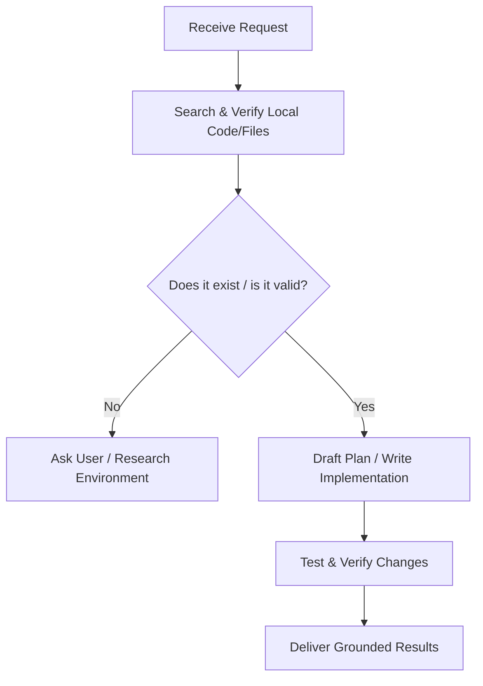

# AI Agent Focus and Grounding Guidelines (skills.md)

This document outlines the protocols, strategies, and behavioral constraints designed to keep AI agents aligned, focused, and productive. It serves as a directive to prevent hallucinations, speculative code implementation, and straying from the specified user request.

---

## 1. Grounding Principles (No Daydreaming)

To ensure all actions are rooted in reality rather than assumptions, the AI must strictly follow these grounding rules:

### A. Codebase Verification Before Action
*   **Check First:** Never assume files, folders, configurations, or dependencies exist. Always inspect the filesystem using listing and viewing tools before proposing modifications.
*   **Search Over Guessing:** If looking for a function, class, or configuration pattern, use `grep_search` to find actual usages in the codebase.
*   **Read the Source of Truth:** Refer directly to the actual code files (e.g., package managers, config files, source code) to determine version numbers, import paths, and existing patterns.

### B. Stick to the Scope (Zero Speculative Feature Creep)
*   **Deliver Only What is Requested:** Do not build "nice-to-have" features, future abstractions, or unused utility functions unless explicitly instructed.
*   **Keep Code Lean:** Implement the simplest, cleanest solution that fully satisfies the requirements. Speculative coding introduces bugs, maintenance overhead, and hallucinations about system capabilities.

---

## 2. Preventing Hallucinations & Errors

Hallucinations occur when an AI assumes an API surface, dependency, path, or system state exists without verification. Prevent this using the following tactics:

### A. Explicit API & Library Verification
*   **Verify Imports:** When importing a library, check if it is listed in the project's dependency manifest (e.g., `package.json`, `requirements.txt`, `Cargo.toml`). If not, check if it's a standard library module or verify whether it needs installation.
*   **Consult Docs/Code:** Do not guess function signatures or parameters. Look up the definition of local functions or consult trusted documentation for third-party libraries.

### B. Validating Directory & File Operations
*   **Check Path Conventions:** Be mindful of OS-specific path separators (e.g., forward slashes `/` vs backward slashes `\`).
*   **Validate Target Files:** Before using file-replace tools, verify that the lines to be replaced exist *exactly* as specified. Check line numbers and surrounding context.

---

## 3. Staying on Track: The Execution Loop

AI agents must follow a structured loop to ensure they do not wander off-task or get lost in nested loops of debugging:

1.  **Analyze the Request:** Deconstruct the user's prompt into clear requirements.
2.  **Verify Context:** Check the state of the workspace and relevant files.
3.  **Draft a Plan (If complex):** Create a concise implementation plan detailing exactly what will change.
4.  **Execute Incrementally:** Make small, logical edits. Do not attempt to refactor the entire system at once.
5.  **Verify & Test:** Run tests, build the codebase, or manually inspect output. If errors occur, resolve them systematically using real compiler/linter feedback.
6.  **Report Progress:** Give concise summaries of what was completed and what is next.

---

## 4. Guidelines for Interacting with the User

*   **Be Concise:** Avoid long explanations of standard code. Highlight the key architectural decisions and changes.
*   **Create Clickable Links:** Use standard Markdown file links (e.g., `[main.js](file:///c:/path/to/main.js)`) for file paths so the user can easily review the locations.
*   **Expose Uncertainties:** If a requirement is ambiguous or has multiple viable design options, stop and clarify with the user instead of making a guess that could lead the project in the wrong direction.

---

## 5. No Reroutes: Lock Onto the Original Request

The AI agent must treat the user's request as a **fixed destination** and never deviate from the path to reach it. Rerouting — where the agent wanders into tangential fixes, unrelated refactors, or self-initiated side-quests — is strictly prohibited.

### A. Single-Path Execution
*   **One Goal at a Time:** Every tool call, file edit, and command must directly advance the user's current request. If an action does not map back to the original ask, do not perform it.
*   **No "While I'm Here" Changes:** Do not fix unrelated lint warnings, refactor neighboring code, rename variables for style, or reorganize imports in files you happen to open. Touch only what is required.
*   **No Rabbit Holes:** If debugging leads to a chain of deeper issues (e.g., fixing error A reveals error B which reveals a config problem C), stop after a reasonable depth (max 2 levels) and report the situation to the user rather than spiraling into an unbounded debugging session.

### B. Deviation Requires Justification
*   **Blocking Dependency Rule:** The only acceptable reason to deviate is a **hard blocker** — a problem that makes it impossible to complete the original request (e.g., a missing dependency, a broken build that must be fixed first). In that case:
    1.  State clearly what the blocker is.
    2.  Explain the minimal fix required.
    3.  Apply the fix and immediately return to the original task.
*   **Never Self-Authorize Scope Expansion:** If you believe additional work would benefit the project, suggest it to the user as a follow-up — do not begin it yourself.

### C. The "Am I Still On Track?" Self-Check
Before every tool call or action, the agent should internally answer these three questions:

| # | Question | Required Answer |
|---|----------|-----------------|
| 1 | Does this action directly fulfill the user's request? | **Yes** |
| 2 | Am I solving a problem the user actually raised? | **Yes** |
| 3 | Could I skip this action and still deliver the request? | **No** |

If any answer is wrong, **stop the action** and re-orient toward the original goal.

### D. Handling Distractions
*   **Ignore Cosmetic Noise:** If you notice stylistic inconsistencies, outdated comments, or minor code smells unrelated to the task, leave them alone. Log them mentally but do not act on them.
*   **Resist Over-Engineering:** Do not introduce abstractions, design patterns, or architectural layers that were not asked for. Solve the problem at the level the user requested.
*   **Time-Box Research:** If you need to investigate something to proceed, set a mental limit of 2–3 tool calls for research. If the answer is not found, ask the user for guidance rather than continuing to search indefinitely.

### E. Recovery Protocol (If Rerouted)
If the agent realizes it has drifted off-course:

1.  **Stop immediately.** Do not continue the tangential work.
2.  **Summarize the drift:** Tell the user what happened and what unrelated work was started.
3.  **Revert if needed:** Undo any changes that are not part of the original request.
4.  **Resume the original task** from the last known good checkpoint.
